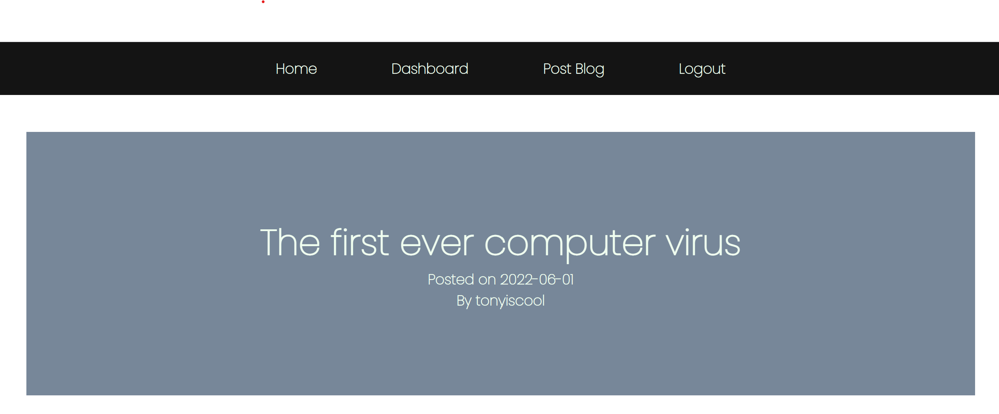

# Tech Blog 📋




## Description 📍
- The Tech Spot is a full stack application that provides a platform for tech enthusiasts to share their ideas among themselves.

## Table Of Contents 📜
* [Installation](#installation)
* [Usage](#usage)
* [Technologies Used](#technologies-used)
* [License](#license)
* [Contribution Guidelines](#contribution-guidelines)
* [Deployed Heroku Link](#heroku)
* [Github Repository](#github-repository)
* [Contact](#contact-information)

## Installation 
 1. Run ``` npm i ``` in the terminal to install the required dependencies
 2. Create an ```.env file``` and input the required MySql credentials
 3. Run the ```schema.sql``` (located in db folder) in the MySQL terminal to create the database and tables
 4. Run ```npm run seed``` to seed the database with data
 5. Run ```npm run start``` in the bash terminal start the server

## Usage 
- The application utilizes handlebars to create a main layout that applies to several endpoints. The main handlebar layout consists of:

```
1. Nav bar 
    - When logged in:
        • Home
        • Dashboard 
        • Post Blog
        • Logout

    - When logged out:
        • Home
        • Login

2. Footer
    - Copyright
```

- In conjunction with handlebars, the application implements express routes to communicate with the seeded data in the API to create endpoints. The endpoints are:

```
1. '/'
    - Homepage
    - Displays all the blogs created
        - Clicking the blog title links to the single blog page. (Must be logged in, redirects to login page if not)

2. '/blogs/:blog_id'
    - Single blog page
    - Displays the blogs contents
    - Displays comments left on blog
    - 'Add comment' button
        - Redirects to comment form page

3. '/blogs/:blog_id/comment'
    - Comment form page
    - Comment content box
    - Add comment button 
        - Redirects back to single blog page of the blog the user left the comment on

4. '/dashboard'
    - Displays all the blogs that the user has posted
        - Click on the blog title to redirect to single blog page
    - 'Delete blog' button
    - 'Edit blog' button
        - Redirects to edit blog form

5. '/blog/update/:blog_id'
    - Edit blog form
    - Edit blog title box
    - Edit blog content box
    - 'Update blog' button
        - Redirects single blog page of the blog that the user updated

6. '/blog/post'
    - Post blog form
    - Post blog title box
    - Post blog content box
    - 'Post blog' button
        - Redirects to dashboard

7. '/login'
    - Login Page
    - Username box
    - Password box
    - Modal pop-up for invalid credentials
    - 'Sign up' link
        - Redirects to signup page

8. '/signup'
    - Signup page
    - Username box (must be unique)
    - Password box (minimum 8 characters)
    - Modal pop-up for invalid entry
    - Signup button
```
##  Technologies Used
- Node
- Express
- Handlebars
- Bcrypt
- MySQL
- Sequelize
- Heroku

##  License
- This project uses the following license:<br>
     - ***MIT***

##  Contribution Guidelines 
- All contributors are welcome! Please don't hesitate to contact me below to contribute to this project.

##  Heroku
- [The Tech Spot Heroku](https://peaceful-sands-08318.herokuapp.com/)

##  Github Repository 
- [The Tech Spot Repository](https://github.com/axe714/The-Tech-Spot)

## Contact Information 
- [Github Profile - Axe714](www.github.com/axe714)
- For inquiries/questions, please reach out to me at allec@gmail.com


